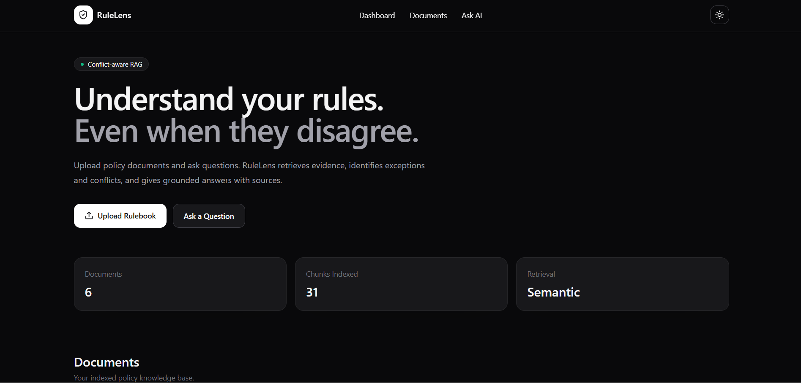
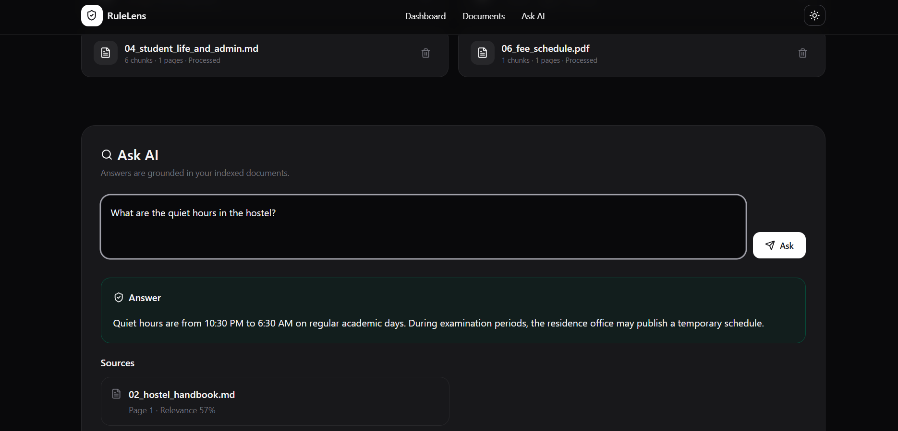
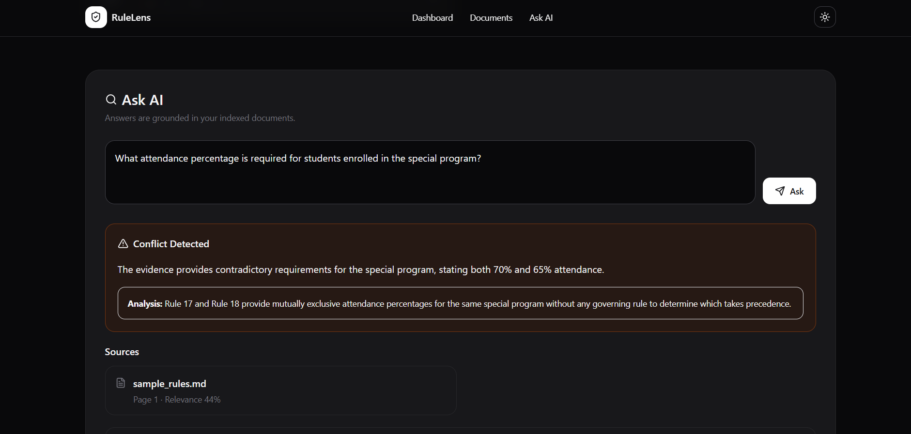
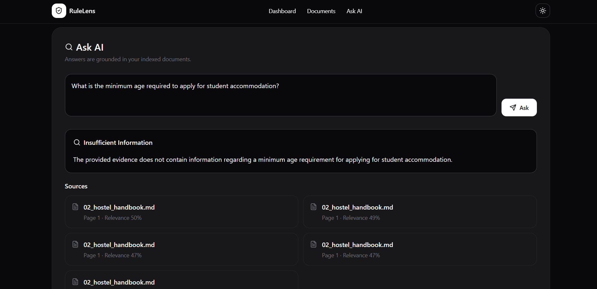

# RuleLens 🔎

### Conflict-Aware RAG for Policy & Rulebook Documents

RuleLens is an AI-powered document retrieval system designed to answer questions from policy and rulebook documents while handling exceptions, contradictions, and missing information.

Unlike a basic document chatbot, RuleLens does not blindly generate an answer. It retrieves relevant evidence, analyzes applicable rules, distinguishes exceptions from genuine conflicts, and abstains when sufficient information is unavailable.

---

## 🚀 Features

- 📄 Upload PDF, TXT, and Markdown policy documents
- 🔍 Semantic search using vector embeddings
- 🧠 Retrieval-Augmented Generation (RAG)
- ⚠️ Detect contradictory applicable rules
- 🔄 Distinguish exceptions from genuine conflicts
- 🛑 Abstain when information is insufficient
- 📚 Display source documents and relevance scores
- 🔎 Show retrieved evidence used for the answer
- 📂 Support multiple policy documents
- 🌙 Dark / Light mode
- ⚡ FastAPI backend with REST APIs

---

## 💡 Problem

Policy and rulebook documents are rarely as simple as a single set of rules.

They can contain:

- General rules
- Exceptions
- Overrides
- Special-case policies
- Conflicting notices
- Missing information

A traditional RAG chatbot may retrieve relevant text but still provide an oversimplified or incorrect answer when multiple rules apply.

### Example

A policy may state:

> General attendance requirement: 75%

while another rule states:

> Approved medical exemption: 60%

The second rule is an **exception**, not necessarily a contradiction.

However, if two applicable rules state:

> Special Program Notice: 70%

and

> General Regulation: 65%

without any precedence rule, the system should identify the situation as a **conflict** rather than arbitrarily selecting one value.

RuleLens is designed around this distinction.

---

## 🧠 How RuleLens Works

```text
                User
                 │
                 ▼
        ┌─────────────────┐
        │    Next.js UI   │
        └────────┬────────┘
                 │
                 │ REST API
                 ▼
        ┌─────────────────┐
        │     FastAPI     │
        │     Backend     │
        └────────┬────────┘
                 │
       ┌─────────┴─────────┐
       │                   │
       ▼                   ▼
 Document Processing    Question
       │               Processing
       ▼                   │
   PyMuPDF                │
       │                   │
       ▼                   ▼
 Text Chunking      Query Embedding
       │                   │
       ▼                   ▼
 Gemini Embeddings ──► ChromaDB
                           │
                           ▼
                    Relevant Evidence
                           │
                           ▼
                      Gemini LLM
                           │
                           ▼
              ┌────────────┼────────────┐
              │            │            │
              ▼            ▼            ▼
           ANSWERED     CONFLICT    INSUFFICIENT
                                      INFORMATION
              │            │            │
              └────────────┼────────────┘
                           ▼
                 Grounded Response
                 + Sources + Evidence
```

---

## 🔄 RAG Pipeline

```text
Document Upload
      ↓
Text Extraction
      ↓
Document Chunking
      ↓
Gemini Embeddings
      ↓
ChromaDB Vector Store
      ↓
Semantic Retrieval
      ↓
Relevant Evidence
      ↓
Gemini LLM
      ↓
Rule Analysis
      ↓
Answer / Conflict / Insufficient Information
      ↓
Grounded Response
+ Sources
+ Retrieved Evidence
```

---

## ⚠️ Conflict-Aware Reasoning

RuleLens classifies retrieved information into three major outcomes.

### 1. ANSWERED

When the retrieved evidence provides enough information to answer the question.

**Example:**

> What is the minimum attendance required for a student with an approved medical exemption?

RuleLens retrieves the general attendance rule and the medical exemption rule and identifies the applicable exception.

**Result:** 60% attendance.

---

### 2. CONFLICT

When multiple applicable rules contradict each other and the available evidence does not establish which rule takes precedence.

**Example:**

> Special Program Notice → 70%

> General Regulation → 65%

RuleLens identifies the contradiction and explains why the conflict cannot be resolved from the available evidence.

---

### 3. INSUFFICIENT INFORMATION

When the uploaded documents do not contain enough relevant information to answer the question.

Instead of generating an unsupported answer, RuleLens explicitly reports that the required information is unavailable.

This helps reduce hallucination in document-based question answering.

---

## 🖼️ Screenshots

### Dashboard



The dashboard provides document statistics, semantic retrieval status, document management, and access to the AI question interface.

---

### Grounded Answer



RuleLens retrieves relevant policy evidence and provides the generated answer along with document sources and relevance information.

---

### Conflict Detection



RuleLens can identify genuinely conflicting applicable rules and explain the ambiguity instead of selecting a value arbitrarily.

---

### Insufficient Information



When the knowledge base does not contain enough evidence, RuleLens abstains instead of hallucinating an answer.

---

## 🛠️ Tech Stack

### Frontend

- Next.js
- React
- TypeScript
- Tailwind CSS
- Lucide React
- next-themes

### Backend

- Python
- FastAPI
- LangChain
- PyMuPDF

### AI / RAG

- Google Gemini
- Gemini Embeddings
- ChromaDB
- Retrieval-Augmented Generation

### Development

- Git
- GitHub
- VS Code
- REST APIs
- Swagger UI

---

## 📁 Project Structure

```text
RuleLens/
│
├── backend/
│   ├── app/
│   │   ├── services/
│   │   │   ├── document_service.py
│   │   │   └── retrieval_service.py
│   │   │
│   │   └── main.py
│   │
│   ├── data/
│   │   └── sample_rules.md
│   │
│   ├── requirements.txt
│   ├── .env.example
│   └── ...
│
├── frontend/
│   ├── src/
│   │   └── app/
│   │       └── page.tsx
│   │
│   ├── package.json
│   └── ...
│
├── .gitignore
└── README.md
```

---

## ⚙️ Installation

### Prerequisites

- Python 3.10+
- Node.js 18+
- npm
- Google Gemini API key

---

### 1. Clone Repository

```bash
git clone https://github.com/vanshhpatil/RuleLens.git
cd RuleLens
```

---

### 2. Backend Setup

```bash
cd backend
```

Create a virtual environment:

```bash
python -m venv venv
```

Activate it on Windows PowerShell:

```powershell
.\venv\Scripts\Activate.ps1
```

Install dependencies:

```bash
pip install -r requirements.txt
```

Create the environment file:

```powershell
Copy-Item .env.example .env
```

Add your Gemini API key:

```env
GEMINI_API_KEY=your_gemini_api_key

LLM_MODEL=gemini-3.1-flash-lite
EMBEDDING_MODEL=gemini-embedding-001

CHROMA_PERSIST_DIRECTORY=./chroma_db
RELEVANCE_THRESHOLD=0.35
```

Start the backend:

```bash
uvicorn app.main:app --reload --port 8000
```

Backend:

```text
http://localhost:8000
```

API documentation:

```text
http://localhost:8000/docs
```

---

### 3. Frontend Setup

Open another terminal:

```bash
cd frontend
```

Install dependencies:

```bash
npm install
```

Create the frontend environment file:

```powershell
Copy-Item .env.example .env.local
```

Start the development server:

```bash
npm run dev
```

Open:

```text
http://localhost:3000
```

---

## 🧪 Example Queries

### Normal Rule

```text
What is the minimum attendance required for a student with an approved medical exemption?
```

**Result:** 60% attendance.

---

### Conflict Detection

```text
What attendance percentage is required for students enrolled in the special program?
```

**Result:** Conflict detected between contradictory requirements.

---

### Missing Information

```text
What is the minimum CGPA required for admission to IIT?
```

**Result:** Insufficient Information.

The system does not generate an unsupported answer because the information is not present in the uploaded documents.

---

## 🎯 Real-World Applications

RuleLens can be adapted for:

- University regulations
- Academic rulebooks
- Employee handbooks
- HR policies
- Company regulations
- Government schemes and regulations
- Insurance policies
- Compliance documents
- Internal organizational guidelines

---

## 📊 Evaluation

RuleLens can be evaluated across multiple dimensions rather than relying only on a fixed set of questions.

### Retrieval

- Retrieval relevance
- Evidence coverage
- Source attribution

### Generation

- Answer correctness
- Groundedness
- Faithfulness

### Conflict Handling

- Conflict detection accuracy
- Exception recognition
- Conflict explanation quality

### Abstention

- Insufficient-information accuracy
- Hallucination avoidance

This allows the system to be evaluated across different documents and question types.

---

## 🔮 Future Enhancements

- Multi-document comparison
- Rule precedence and authority ranking
- Policy version tracking
- Outdated policy detection
- Hybrid keyword + semantic retrieval
- Advanced RAG evaluation
- Document version history
- Improved citation highlighting
- Authentication and role-based access
- Cloud deployment

---

## 🔐 Security

API keys and local environment files should never be committed to the repository.

The project ignores sensitive and generated files such as:

```text
.env
.env.*
venv/
node_modules/
.next/
chroma_db/
data/uploads/
__pycache__/
```

Use `.env.example` to document the required environment variables.

---

## 👨‍💻 Author

**Vansh Patil**

Computer Science | Full-Stack Development | AI & RAG

GitHub:  
https://github.com/vanshhpatil

---

## ⭐ Project Highlight

> RuleLens goes beyond traditional document Q&A by distinguishing normal rules, exceptions, genuine contradictions, and insufficient information while grounding responses in retrieved policy evidence.